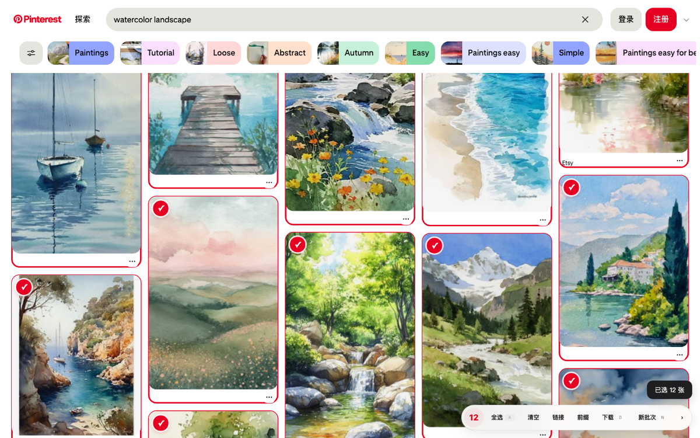
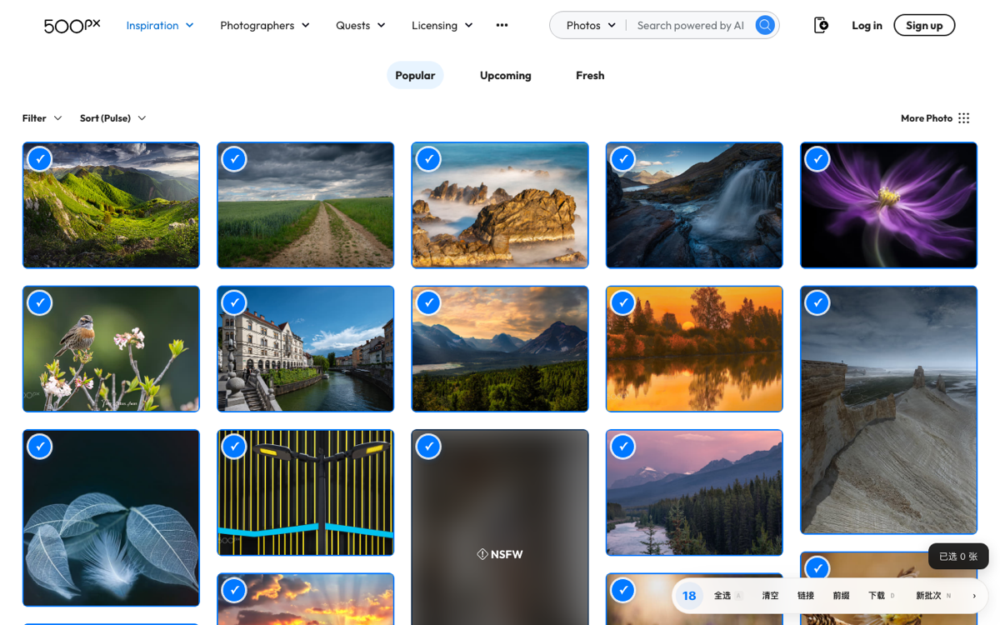
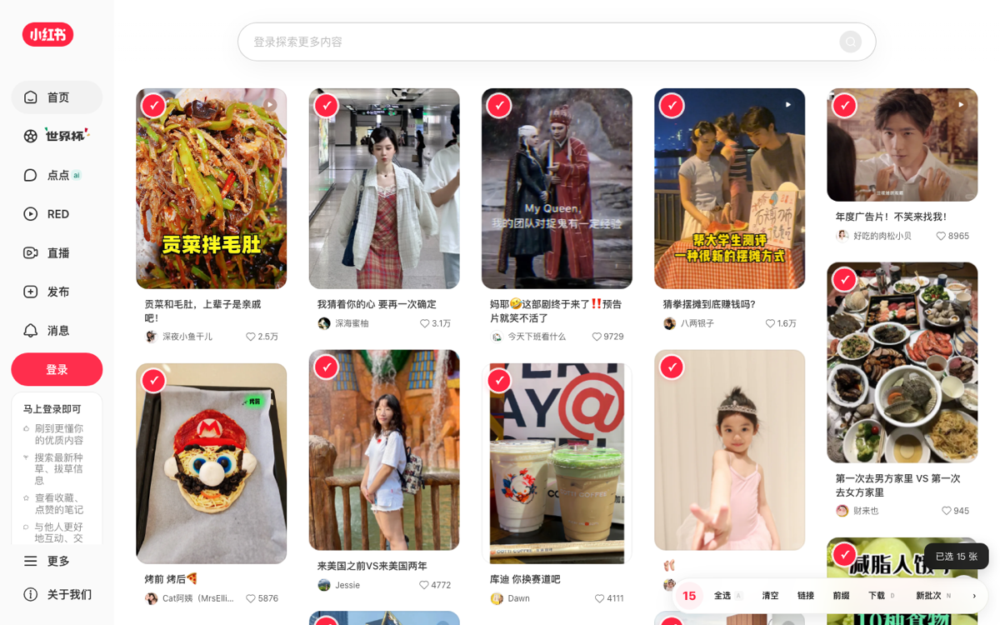
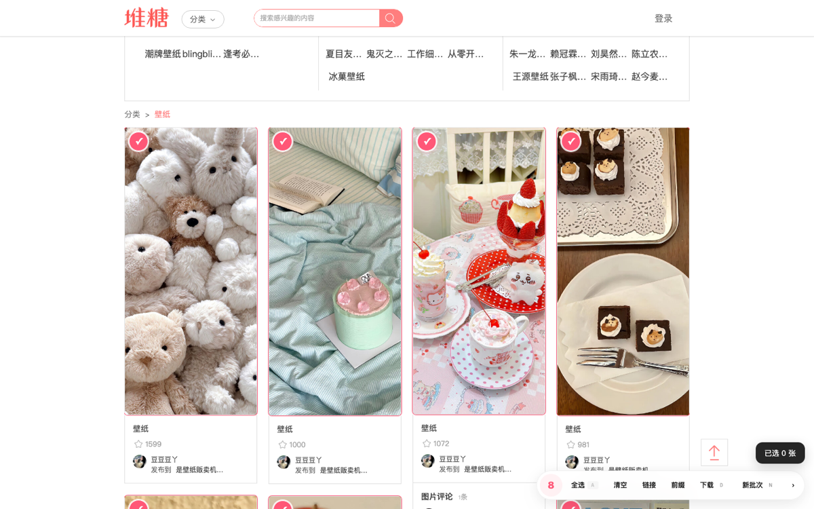
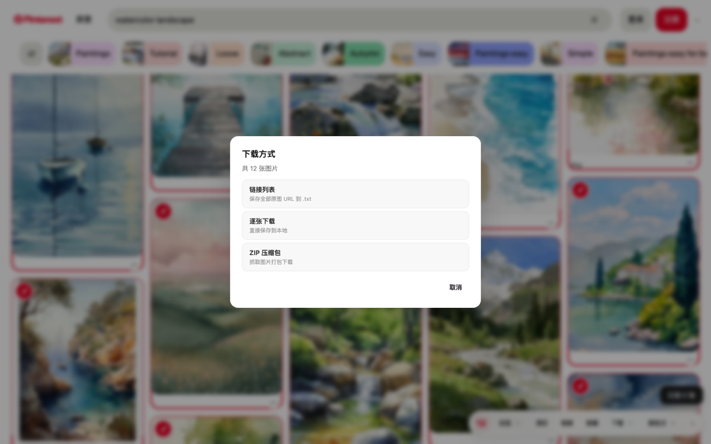

# Tampermonkey Scripts / 油猴脚本集

一组实用的 [Tampermonkey](https://www.tampermonkey.net/) 用户脚本，解决日常浏览中的实际痛点。

**[>>> 一键打包下载全部脚本 <<<](https://github.com/nevertoday/tampermonkey-scripts/archive/refs/heads/main.zip)**

---

## 图片下载

> 路径：`图片下载/`

在图片类网站上批量选择、下载原图。支持 6 个主流平台：

| 脚本 | 适用站点 | 文件 |
|------|----------|------|
| **Pinterest 图片选择器** | pinterest.com | `pinterest-图片选择器.user.js` |
| **小红书图片选择器** | xiaohongshu.com | `小红书-图片选择器.user.js` |
| **花瓣图片选择器** | huaban.com | `花瓣-图片选择器.user.js` |
| **微信公众号图片选择器** | mp.weixin.qq.com | `微信公众号-图片选择器.user.js` |
| **堆糖图片选择器** | duitang.com | `堆糖-图片选择器.user.js` |
| **500px 图片选择器** | 500px.com | `500px-图片选择器.user.js` |

### 效果预览

**Pinterest — 批量收集灵感图**：按一下 `A` 选中整屏，红框 + `✓` 持久标记，右下角 Dock 实时显示已选数量。



| 500px — 摄影大图批量选择 | 小红书 — 笔记瀑布流选择 |
|:---:|:---:|
|  |  |
| **堆糖 — 壁纸瀑布流选择** | **一键打包 — 三种下载方式** |
|  |  |

> 截图均为脚本在真实网站上的实际运行效果。

### 解决什么问题

这些网站的图片**无法直接右键保存原图**——要么被 CSS 背景图替代，要么套了防右键的事件拦截，要么缩略图和原图 URL 结构完全不同，要么 CDN 有跨域限制。手动一张张操作极其繁琐，更别提批量下载几十张图。

这套脚本让你像在文件管理器里勾选文件一样，**悬停勾选、一键打包**，整个过程不超过 10 秒。

### 统一的交互方式

所有 6 个脚本共享一致的操作逻辑，学会一个就会全部：

**选择图片：**
- 鼠标悬停到图片上 → 左上角出现圆形 `+` 按钮 → 点击选中
- 选中的图片出现蓝色边框和 `✓` 标记，**持久显示**（滚动、翻页后仍在）
- 按 `S` 或 `A` 键可快捷选中鼠标下方的图片，无需精确点按钮
- 选中状态通过 Tampermonkey 存储跨页面保留

**底部控制栏（Dock）：**

页面右下角常驻一个圆角浮动面板，显示已选数量和操作按钮：

| 按钮 | 快捷键 | 功能 |
|------|--------|------|
| 全选 | `A` | 选中当前屏幕可见的所有图片 |
| 清空 | — | 清除全部选中 |
| 链接 | — | 查看已选图片的 URL 列表（可复制） |
| 前缀 | — | 自定义下载文件名前缀 |
| 下载 | `D` | 下载已选图片（弹出方式选择） |
| 新批次 | `N` | 设置新前缀后下载 |

面板可收起为一个小圆点，不遮挡浏览。

**三种下载方式：**

| 方式 | 说明 | 适合场景 |
|------|------|----------|
| 链接列表 | 导出所有原图 URL 到 `.txt` 文件 | 配合 IDM / aria2 等下载工具 |
| 逐张下载 | 逐一调用浏览器下载（600ms 间隔，防拦截） | 少量图片，想直接保存到本地 |
| ZIP 压缩包 | 在浏览器内抓取图片并打包为 `.zip` | 批量下载的首选方式 |

### 各站点特殊处理

每个平台的页面结构和 CDN 策略都不同，脚本针对性解决了这些问题：

**Pinterest**
- 图片使用 `i.pinimg.com` CDN，URL 中通过路径段控制尺寸（`236x` → `originals`）
- 脚本自动将缩略图 URL 替换为原图 URL
- SPA 架构，脚本通过 `MutationObserver` + `pushState` hook 持续追踪新加载的图片

**小红书**
- 图片走 `xhscdn.com` CDN，轮播图中每张图独立可选
- 详情页弹窗内的图片同样可以选中
- URL 参数自动清理以获取最高画质

**花瓣**
- 图片走 `gd-hbimg-edge.huaban.com` / `gd-hbimg-other.huaban.com` CDN，瀑布流卡片密集
- 脚本剥离 `/small/` 与 `_fw240webp` 等缩略标记还原原图，并保留 `auth_key` 鉴权参数
- 卡片整体是 `/pins/` 链接，采用页面级浮动按钮，避免点击被卡片链接劫持
- 自动按 pin 链接、尺寸和类名过滤掉头像、图标等非内容图

**微信公众号**
- 文章图片使用 `mmbiz.qpic.cn`，带 `wx_fmt` 参数控制格式
- 脚本自动过滤头像、二维码、装饰图等非内容图片
- 跨域限制通过 `GM_xmlhttpRequest` 绕过

**堆糖**
- 缩略图 URL 含 `.thumb.300_300_c.jpg_webp` 等后缀
- 脚本精确剥离缩略图标记，还原为原图 URL（去除 `_c` 和 `_webp` 后缀）
- 瀑布流无限滚动页面，实时检测新图片

**500px**
- CDN URL 带签名参数 `sig`，无法直接修改尺寸参数（会 403）
- 图片卡片上方有多层覆盖元素（链接、渐变遮罩），脚本通过容器追溯确保悬停选择不受阻挡
- 使用图片当前可用的最高画质 URL

### 技术亮点

- **纯客户端打包**：ZIP 文件在浏览器内生成（手写 ZIP 格式头），无需服务端，不上传任何图片
- **跨域下载**：通过 Tampermonkey 的 `GM_xmlhttpRequest` 和 `GM_download` 突破浏览器同源策略
- **串行下载防拦截**：逐张下载模式自动加入 600ms 间隔，避免浏览器批量下载拦截
- **SPA 适配**：hook `history.pushState` / `replaceState` + `MutationObserver`，无论如何翻页都不丢失状态
- **选中持久化**：选中状态存储在 `GM_setValue` 中，关闭页面后重新打开仍然保留
- **零依赖**：每个脚本完全独立，无外部库依赖，单文件即用

---

## 安装方法

### 1. 安装 Tampermonkey

在浏览器扩展商店安装 [Tampermonkey](https://www.tampermonkey.net/)：
- [Chrome Web Store](https://chrome.google.com/webstore/detail/tampermonkey/dhdgffkkebhmkfjojejmpbldmpobfkfo)
- [Firefox Add-ons](https://addons.mozilla.org/firefox/addon/tampermonkey/)
- [Edge Add-ons](https://microsoftedge.microsoft.com/addons/detail/tampermonkey/iikmkjmpaadaobahmlepeloendndfphd)

### 2. 安装脚本

**方法一：直接安装（推荐）**

点击下方链接，Tampermonkey 会自动弹出安装确认：

- [Pinterest 图片选择器](https://github.com/nevertoday/tampermonkey-scripts/raw/main/图片下载/pinterest-图片选择器.user.js)
- [小红书图片选择器](https://github.com/nevertoday/tampermonkey-scripts/raw/main/图片下载/小红书-图片选择器.user.js)
- [花瓣图片选择器](https://github.com/nevertoday/tampermonkey-scripts/raw/main/图片下载/花瓣-图片选择器.user.js)
- [微信公众号图片选择器](https://github.com/nevertoday/tampermonkey-scripts/raw/main/图片下载/微信公众号-图片选择器.user.js)
- [堆糖图片选择器](https://github.com/nevertoday/tampermonkey-scripts/raw/main/图片下载/堆糖-图片选择器.user.js)
- [500px 图片选择器](https://github.com/nevertoday/tampermonkey-scripts/raw/main/图片下载/500px-图片选择器.user.js)

**方法二：手动安装**

1. 复制脚本文件的全部内容
2. 打开 Tampermonkey 仪表盘 → 实用工具 → 从 URL 导入（填入 raw 文件链接）
3. 或新建脚本 → 粘贴内容 → 保存

### 3. 使用

打开对应网站，页面右下角出现控制面板即说明脚本生效。悬停图片开始选择。

---

## Chrome 扩展版（无需 Tampermonkey）

> 路径：`图片下载/extension/`

如果你不想装 Tampermonkey，也可以用打包好的 **Chrome MV3 扩展「图拾 Dock」**，功能与脚本一致，并多了一个**侧边栏**：站点切换、历史回看、设置开关、一键下载都集中在面板里。

**亮点：**
- 浏览器原生侧边栏，集中管理选择与下载，不占用网页空间
- 支持全部 6 个站点，复用脚本同款的 URL 还原与内容图过滤逻辑
- 三种下载方式：打包 ZIP / 逐张下载原图 / 保存链接文本
- **历史**标签记录每次下载/复制，可按站点筛选、预览缩略图并一键重新下载
- 通过 `declarativeNetRequest` 为图床请求改写 Referer，绕过花瓣等站点的防盗链（预览与抓取都不再 403）
- 可在设置里开关网页快捷栏、悬停按钮、键盘快捷键，并自定义各站文件名前缀

**安装（开发者模式加载）：**
1. 下载本仓库（[ZIP](https://github.com/nevertoday/tampermonkey-scripts/archive/refs/heads/main.zip)）并解压
2. Chrome 打开 `chrome://extensions/`，右上角开启「开发者模式」
3. 点击「加载已解压的扩展程序」，选择 `图片下载/extension/` 目录
4. 打开支持的网站，点击工具栏图标唤出侧边栏即可使用

设计与实现文档见 `图片下载/extension/docs/`。

---

## 项目结构

```
油猴脚本/
├── README.md
├── screenshots/                  # 运行截图
├── 图片下载/
│   ├── pinterest-图片选择器.user.js
│   ├── 小红书-图片选择器.user.js
│   ├── 花瓣-图片选择器.user.js
│   ├── 微信公众号-图片选择器.user.js
│   ├── 堆糖-图片选择器.user.js
│   ├── 500px-图片选择器.user.js
│   └── extension/                # Chrome MV3 扩展版「图拾 Dock」（含侧边栏）
│       ├── manifest.json
│       ├── background.js         # 下载服务（ZIP 打包 / 下载）
│       ├── content/              # 页面检测与选择 UI、站点适配
│       ├── sidepanel/            # 侧边栏界面（站点 / 历史 / 设置）
│       ├── rules/                # declarativeNetRequest 防盗链 Referer 规则
│       ├── assets/               # 图标与打赏二维码
│       └── docs/                 # 设计与实现文档
└── (更多脚本分类待补充)
```

每个子目录按用途分类，后续会持续添加新脚本。

---

## 兼容性

- Tampermonkey v4.x+ (Chrome / Firefox / Edge)
- 需要 `GM_setValue`、`GM_getValue`、`GM_xmlhttpRequest`、`GM_download` 权限
- 已在 macOS Chrome 最新版测试通过

---

## 支持作者

这套图片选择器会继续保持免费开源。如果它帮你省下了一张张存图的时间，欢迎 Star、分享给需要的人，或者扫描下面的二维码请小小东喝杯咖啡，让他继续优化脚本、适配更多站点。反馈和 issue 同样有帮助。

<p>
  
  
  
</p>

## 许可证

MIT License
